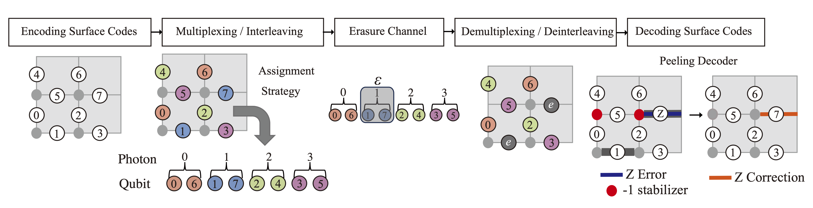

# Multiplexed Toric Codes on Erasure Channel
This is a C++ implementation of multiplexed toric codes simulator.
  
## Simulation Flow
You can simulate the multiplexed quantum communication with surface code by `g++ -O2 -std=c++20 *.cpp -o main && "your_path/multiplexed_toric/src/"main;` and then you get `result.json`.

Simulation flows are:
- Multiplexing (assign qubits to photons)
- Erasure error on a photon -> erasure errrors on multiple qubits
- Replace erased qubits with mixed state -> erasure can be regarded as a random Pauli error.
- X stabilizer measurement
- Run peeling decoder
- Determines if any Z logical errors remain after decoding.

You can visualize the result of the simulation as .png file with python `python draw_toric.py LATTICE_SIZE_V LATTICE_SIZE_H "result.json";`

You will get something like this:

## Requirements
- [nlohmann/json](https://github.com/nlohmann/json)
  - JSON library for C++

## Citation 
ArXiv submission is available at [HERE](). For the citation of this work, please use this bibtex file.

To be updated

If you have any question on this implementation, send email to parton(at)nii.ac.jp (Shin Nishio).