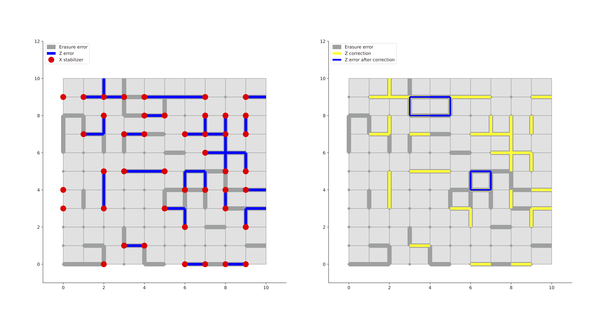

# multiplexed toric codes on erasure channels
- C++ implementation of multiplexed toric codes simulator
  
## Simulation Flow
- Multiplexing (assign qubits to photons)
- Erasure error on a photon cause erasure errrors on multiple qubits
- Replace erased qubits with mixed state -> erasure can be regarded as a random Pauli error.
- X/Z stabilizer measurement
- Run peeling decoder
- Determines if any logical errors remain after decoding.
  - X/Z stabilizer measurement
  - Matching errors that remain after decoding

- Visualize the result of the simulation on Jupyter notebook

## Requirements
- [nlohmann/json](https://github.com/nlohmann/json)
  - JSON library for C++

- [PyMatching](https://github.com/oscarhiggott/PyMatching)
  - MWPM decoder
  - Determines if a logical error occurred during simulation